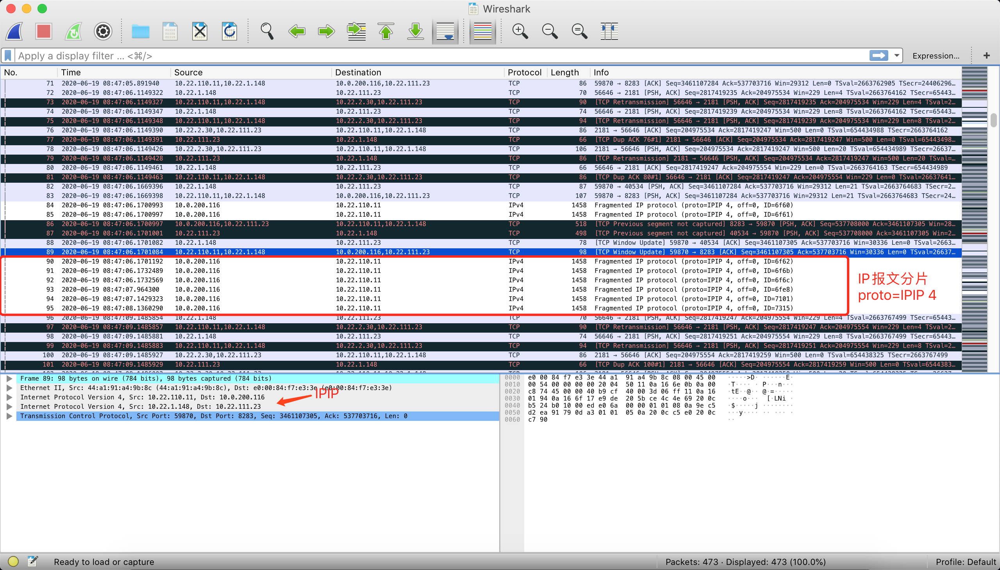

[TOC]

# 报文分析笔记---常见wireshark报文标记

## Fragmented IP protocol

```
Fragmented IP protocol  ----报文分片
```




关于报文分片，会在wireshark中有首选项进行配置；


当前取消勾选后：


关于该配置的说明：

简单说明，

开启该选项时，wireshark 会尝试重组分片报文，并会在成功重组报文之前，只会将报文分片解析为IP协议数据报文，即第一副图的IPV4协议报文；当然如第一图，分片后的IPV4报文并没有成功重组；

关闭该选项时，wireshark 不会进行分片报文的重组，直接解析，所以对于分片报文而言，可能会有异常的标记，需要注意；

第一副图IPV4报文未成功重组的原因，是环境异常，定位后原因为原始数据报文是IPIP隧道封装的双层报文，在数据传输中，途径的一个网元节点，是按照外层报文进行的分片hash，导致分片报文被hash到了不同的后端节点上，进而不能正确重组；即大包做了外层分片，不能保证同一个大包的不同分片能hash到同一个LD；

关于wireshark该选项的引用说明：

https://wiki.wireshark.org/IP_Reassembly

https://www.wireshark.org/lists/wireshark-users/200706/msg00116.html

> ## IP Reassembly
>
> IP Reassembly is a feature in Wireshark and TShark to automatically reassemble all fragmented [IP](https://wiki.wireshark.org/IP) Datagrams into a full [IP](https://wiki.wireshark.org/IP) packet before calling the higher layer dissector.
>
> This feature will require a lot of extra memory to be consumed by wireshark in order to store the reassembly buffers and is disabled by default.
>
> To enable IP Reassembly, go to preferences and tick the box for reassembly
>
> When you enable IP Reassembly several things in TShark and Wireshark change. First of all, Wireshark will no longer dissect the [UDP](https://wiki.wireshark.org/UDP) or [TCP](https://wiki.wireshark.org/TCP) header (or any protocol above these) in the frame that contained the header of the [IP](https://wiki.wireshark.org/IP) packet any more. Instead, the calling of the [UDP](https://wiki.wireshark.org/UDP) or [TCP](https://wiki.wireshark.org/TCP) protocol dissectors will be deferred until all [IP](https://wiki.wireshark.org/IP) fragments have been received and the full [IP](https://wiki.wireshark.org/IP) datagram has been fully reassembled.
>
> This difference shows up as that without IP Reassembly the upper layer protocol, [UDP](https://wiki.wireshark.org/UDP) or [TCP](https://wiki.wireshark.org/TCP) and whatever sits above it, as much as was present in this frame of the initial fragment (where fragment offset is 0) will be dissected and displayed for that particular frame. This frame will also usually have an information text in the packet summary line along the lines of "[Short Frame]". All the other [IP Fragment](https://wiki.wireshark.org/IP Fragment)s for this [IP](https://wiki.wireshark.org/IP) datagram will be dissected only up to and including the [IP](https://wiki.wireshark.org/IP) layer.
>
> When this feature is enabled, dissection of the [IP](https://wiki.wireshark.org/IP) datagram will be deferred until that packet in the capture where the full [IP](https://wiki.wireshark.org/IP) datagram was completely reassembled.
>
> This means that some packets that are using reassembly, such as [NFS](https://wiki.wireshark.org/NFS)over[UDP](https://wiki.wireshark.org/UDP), will dissect differently, and even in different frames when IP Reassembly is enabled.
>
> IP Reassembly is an all-or-nothing feature. If not every single [IP Fragment](https://wiki.wireshark.org/IP Fragment) required to complete the reassembly can be found in the capture, then nothing at all will be dissected. Not even the [TCP](https://wiki.wireshark.org/TCP) or [UDP](https://wiki.wireshark.org/UDP) layer.
>
> Common reasons why IP Reassembly fails to reassemble packets:
>
> - Short packets. You have captured packets with a [SnapLen](https://wiki.wireshark.org/SnapLen) less than the [MTU](https://wiki.wireshark.org/MTU) of the link and thus some of the packet(s) content are missing, then Wireshark will not even try to perform reassembly.
> - IP Header Checksum is invalid. If the IP Header Checksum is invalid, then the IP Reassembly function will ignore the packet.
> - Some of the [IP Fragment](https://wiki.wireshark.org/IP Fragment)s are just plain missing from the capture. This is a fact of life, you will never have a guarantee that every single packet that went across the wire was actually captured and written to the Capture File. sorry that is just a fact of life 
>
> ### Beware
>
> This feature WILL consume a lot of additional memory at runtime if there are [IP Fragment](https://wiki.wireshark.org/IP Fragment)s present in the trace. It is a very very bad idea to enable this feature for huge [NFS](https://wiki.wireshark.org/NFS)over[UDP](https://wiki.wireshark.org/UDP) traces since that will eat memory like there is no tomorrow.


包附件：


## Packet size limited during capture

该标记说明对应报文未抓全；

例如该片报文长度44 byte ，抓包只抓到了20  byte，就会出现该标记提示；

可能和抓包方式有关系，在抓包时，无论是tcpdump/wireshark 都可以配置抓包长度；tcpdump 选项 -s 指定抓包长度；

```shell
# 模拟命令，规避该现象可以 tcpdump -s0  抓取全部报文长度；
tcpdump -i any -nne -vv -s 40 icmp -w icmp_size_limited_during_capture.pcapng
```


## 下面的待补充


## [待]TCP Previous segment not captured

在TCP传输过程中，同一台主机发出的数据段应该是连续的，即后一个包的Seq号等于前一个包的Seq Len（三次握手和四次挥手是例外）。如果Wireshark发现后一个包的Seq号大于前一个包的Seq Len，就知道中间缺失了一段数据。假如缺失的那段数据在整个网络包中都找不到（即排除了乱序），就会提示［TCP Previous segment not captured］。比如在图2这个例子中，6号包的Seq号1449大于5号包的Seq Len=1 0=1，说明中间有个携带1448字节的包没被抓到，它就是“Seq=1, Len=1448”。


网络包没被抓到还分两种情况：一种是真的丢了；另一种是实际上没有丢，但被抓包工具漏掉了。在Wireshark中如何区分这两种情况呢？只要看对方回复的确认（Ack）就行了。如果该确认包含了没抓到的那个包，那就是抓包工具漏掉而已，否则就是真的丢了。

顺便分析一下图2这个网络包，它是HTTPS传输异常时在客户端抓的。因为“Len: 667”的小包（即6号包）可以送达，但“Len: 1448”的大包却丢了，说明路径上可能有个网络设备的MTU比较小，会丢弃大包。后来的解决方式证实了这个猜测，只要把整个网络路径的MTU保持一致，问题就消失了。


## TCP ACKed unseen segment

当Wireshark发现被Ack的那个包没被抓到，就会提示 [TCP ACKed unseen segment］。这可能是最常见的Wireshark提示了，幸好它几乎是永远可以忽略的。以图3为例，32号包的Seq Len=6889 1448=8337，说明服务器发出的下一个包应该是Seq=8337。而我们看到的却是35号包的Seq=11233，这意味着8337～11232这段数据没有被抓到。这段数据本应该出现在34号之前，所以Wireshark提示了[TCP ACKed unseen segment]。

不难想象，在一个网络包的开头会经常看到这个提示，因为只抓到了后面的Ack但没抓到前面的数据包。


## TCP Out-of-Order

在TCP传输过程中（不包括三次握手和四次挥手），同一台主机发出的数据包应该是连续的，即后一个包的Seq号等于前一个包的Seq Len。也可以说，后一个包的Seq会大于或等于前一个包的Seq。当Wireshark发现后一个包的Seq号小于前一个包的Seq Len时，就会认为是乱序了，因此提示 [TCP Out-of-Order] 。如图4所示，3362号包的Seq=2685642小于3360号包的Seq=2712622，所以就是乱序。

 

小跨度的乱序影响不大，比如原本顺序为1、2、3、4、5号包被打乱成2、1、3、4、5就没事。但跨度大的乱序却可能触发快速重传，比如打乱成2、3、4、5、1时，就会触发足够多的Dup ACK，从而导致1号包的重传。


## TCP Dup ACK


当乱序或者丢包发生时，接收方会收到一些Seq号比期望值大的包。它每收到一个这种包就会Ack一次期望的Seq值，以此方式来提醒发送方，于是就产生了一些重复的Ack。Wireshark会在这种重复的Ack上标记[TCP Dup ACK] 。

以图5为例，服务器收到的7号包为“Seq=29303, Len=1460”，所以它期望下一个包应该是Seq Len=29303 1460=30763，没想到实际收到的却是8号包Seq=32223，说明Seq=30763那个包可能丢失了。因此服务器立即在9号包发了Ack=30763，表示“我要的是Seq=30763”。由于接下来服务器收到的10号、12号、14号也都是大于Seq=30763的，因此它每收到一个就回复一次Ack=30763，从图中可见Wireshark在这些回复上都标记了[TCP Dup ACK]。


图5

 

## TCP Fast Retransmission

当发送方收到3个或以上[TCP Dup ACK]，就意识到之前发的包可能丢了，于是快速重传它（这是RFC的规定）。以图6为例，客户端收到了4个Ack=991851，于是在1177号包重传了Seq=991851。

 ## TCP Spurious Retransmission


## TCP Retransmission


如果一个包真的丢了，又没有后续包可以在接收方触发[Dup Ack]，就不会快速重传。这种情况下发送方只好等到超时了再重传，此类重传包就会被Wireshark标上[TCP Retransmission]。以图7为例，客户端发了原始包（包号1053）之后，一直等不到相应的Ack，于是只能在100多毫秒之后重传了（包号1225）。

 

超时重传是一个非常有技术含量的知识点，比如等待时间的长短就大有学问，本文就不细说了，毕竟需要懂这个的人很少。

## TCP zerowindow

TCP包中的“win=”代表接收窗口的大小，即表示这个包的发送方当前还有多少缓存区可以接收数据。当Wireshark在一个包中发现“win=0”时，就会给它打上“TCP zerowindow”的标志，表示缓存区已满，不能再接受数据了。比如图8就是服务器的缓存区已满，所以通知客户端不要再发数据了。我们甚至可以在3258～3263这几个包中看出它的窗口逐渐减少的过程，即从win=15872减小到win=1472。


图8

 

## TCP window Full


当Wireshark在一个包中打上[TCP window Full]标志时，就表示这个包的发送方已经把对方所声明的接收窗口耗尽了。以图9为例，Britain一直声明它的接收窗口只有65535，意味着Middle East最多能给它发送65535字节的数据而无需确认，即“在途字节数”最多为65535字节。当Wireshark在包中计算出Middle East已经有65535字节未被确认时，就会发出此提示。至于Wireshark是怎么计算的，请参考本书的《计算“在途字节数”》一文。


图9

 

[TCP window Full]很容易跟［TCP zerowindow］混淆，实际上它们也有相似之处。前者表示这个包的发送方暂时没办法再发送数据了，后者表示这个包的发送方暂时没办法再接收数据了，也就是说两者都意味着传输暂停，都必须引起重视。

## TCP window Update


## TCP segment of a reassembled PDU


当你收到这个提示，肯定已经在EditàPreferencesààTCP菜单里启用了Allow sub dissector to reassemble TCP streams。它表示Wireshark可以把属于同一个应用层PDU（比如SMB的Read Response和Write Request之类）的TCP包虚拟地集中起来。如图10所示，这一个SMB Read Response由39～48号包共同完成，因此Wireshark在最后一个包中虚拟地把所有包集中起来。这样做有个好处，就是可以右键点击图10底部的方框，选择CopyàBytesàPrintable Text Only，从而复制整个应用层的PDU。做研发的同学可能比较需要这个功能。

图10

 

## Continuation to 

你看到这个提示，说明已经在EditàPreferencesàProtocolsàTCP菜单里关闭了Allow sub dissector to reassemble TCP streams。比如图10的那些包，一关闭就变成图11这样。


图11

 

仔细对比图10和图11，你会发现Read Response在图10中被算在了48号包头上，而在图11中被算到了39号包头上。这样会带来一个诡异的结果：图10的读响应时间为2.528毫秒（38号包和48号包的时间差），而图11的读响应时间为2.476毫秒（38号包和39号包的时间差）。究竟哪个算正确呢？这个问题很难回答，如果在乎的是实际的总性能，那就看前者；如果想忽略TCP/IP协议的损耗，单看服务器的响应速度，那就看后者。在某些特殊情况下，这两者相差非常大，所以必须搞清楚。

## Time-to-live exceeded (Fragment reassembly time exceeded)

ICMP的报错有好多种，大都不难理解，所以我们只举其中的一种为例。 [Fragment reassembly time exceeded]表示这个包的发送方之前收到了一些分片，但是由于某些原因迟迟无法组装起来。比如在图12中，由于上海发往北京的一些包被分片传输，且有一部分在路上丢失了，所以北京方无法组装起来，便只好用这个ICMP报错告知上海方。

##     TCP keep-alive


## TCP keep-alive ACK

